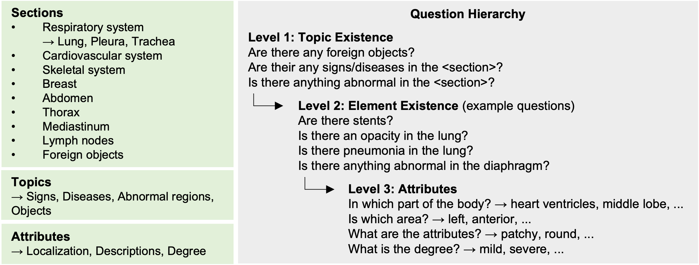
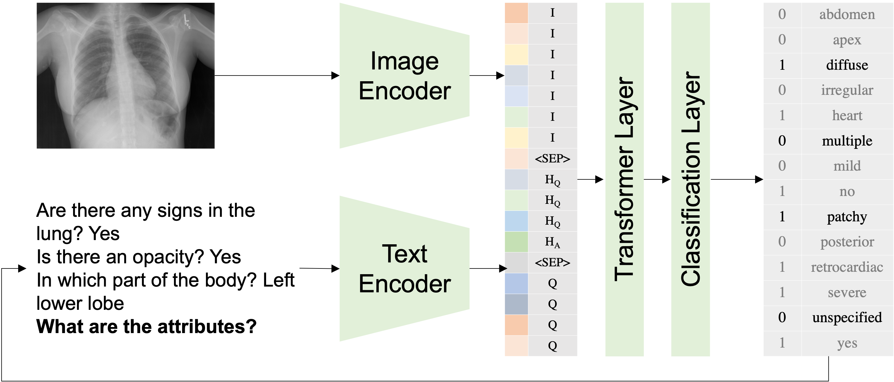

# Rad-ReStruct: A Novel VQA Benchmark and Method for Structured Radiology Reporting
**Paper**: [](https://arxiv.org/pdf/2303.13391.pdf)

This is the official repository for the paper "Rad-ReStruct: A Novel VQA Benchmark and Method for Structured Radiology Reporting", 
which was accepted for publication at MICCAI 2023. This repo includes our code as well as our structured reporting dataset.

#### Dataset Overview: 



#### Model Architecture:



We introduce Rad-ReStruct, a new benchmark dataset that provides fine-grained, hierarchically ordered annotations in the form of structured reports for 
X-Ray images. Our dataset provides structured labels for the images in the IU-XRay dataset available on OpenI [1]. We model the structured reporting task 
as hierarchical visual question answering (VQA) and propose hi-VQA, a novel method that considers prior context in the form of previously asked questions 
and answers for populating a structured radiology report. In this repo we provide the structured reports as well as the list of questions to fill this 
report for every image. 
**Authors**: [Chantal Pellegrini][cp], [Matthias Keicher][mk], [Ege Özsoy][eo], [Nassir Navab][nn]

[cp]:https://www.cs.cit.tum.de/camp/members/chantal-pellegrini/
[mk]:https://www.cs.cit.tum.de/camp/members/matthias-keicher/
[eo]:https://www.cs.cit.tum.de/camp/members/ege-oezsoy/
[nn]:https://www.cs.cit.tum.de/camp/members/cv-nassir-navab/nassir-navab/


[1] Demner-Fushman, D., Antani, S., Simpson, M., & Thoma, G. R. (2012). Design and development of a multimodal biomedical information retrieval system. Journal of Computing Science and Engineering, 6(2), 168-177.


### Setup:
1. Clone this repository
   ```
   git clone https://github.com/ChantalMP/Rad-ReStruct.git
   ```
2. Install requirements:
   ```
   conda create -n xplainer_env python=3.9
   conda activate xplainer_env
   pip install -r requirements.txt
   ```
   
3. Download data
   
   Rad-ReStruct:
   - download images from https://openi.nlm.nih.gov/imgs/collections/NLMCXR_png.tgz
   - unpack and copy image files into 'data/radrestruct/images'
  
   VQARad:
   - download images as zip from 'https://osf.io/89kps/'
   - unpack and copy image files into 'data/vqarad/images'

### Use the Rad-ReStruct dataset:

#### Training with VQA Dataset:
- The dataset is available in the folder 'data/radrestruct'
- To load the dataset use the following code. This will load the dataset as VQA dataset, where one sample is an image together with a single question + history.
  
```
  from data_utils.data_radrestruct import RadReStruct
  
  # required parameters
  parser = argparse.ArgumentParser(description="Finetune on RadReStruct")

  parser.add_argument('--bert_model', type=str, required=False, default="zzxslp/RadBERT-RoBERTa-4m", help="pretrained question encoder weights")
  parser.add_argument('--max_position_embeddings', type=int, required=False, default=458, help="max length of sequence")
  parser.add_argument('--img_feat_size', type=int, required=False, default=14, help="dimension of last pooling layer of img encoder")
  parser.add_argument('--num_question_tokens', type=int, required=False, default=20, help="number of tokens for question")

  args = parser.parse_args()
  args.num_image_tokens = args.img_feat_size ** 2
  args.num_question_tokens = 458 - 3 - args.num_image_tokens
  
  # load dataset
  train_tfm, val_tfm = ... # image transforms, our transforms can be found in 'train_radrestruct.py' (line 100)
  traindataset = RadReStruct(tfm=train_tfm, mode='train', args=args)
  valdataset = RadReStruct(tfm=test_tfm, mode='val', args=args)
  ```

#### Report-based Evaluation:

- For evaluation, we need to ensure consistency of the entire report, therefore we provide an evaluation dataset, where one sample is an image together 
- with the entire structured report. To load this dataset use the following code:

```
  from data_utils.data_radrestruct import RadReStructEval
  
  # required parameters
  ...
  
  # load dataset
  val_tfm = ... # image transforms, our transforms can be found in 'evaluate_radrestruct.py' (line 100)
  valdataset = RadReStructEval(tfm=test_tfm, mode='test', args=args, limit_data=2)
```

- To evaluate your model with our metrics, we provide an evaluator class, which can be used as follows:
```
    from evaluation.evaluator_radrestruct import AutoregressiveEvaluator
    
    preds = ...
    evaluator = AutoregressiveEvaluator()
    targets = get_targets_for_split('test')
    acc, acc_report, f1, precision, recall, detailed_metrics = evaluator.evaluate(preds, targets)
```
- The evaluator expects a 2470-dim binary prediction vector per report. Each element denotes if a certain answer to a question is set to true or false. 
The rows of this vector are defined in 'data/radrestruct/report_keys.json' and correspond to all possible paths in the report template. Answers to questions that are 
not predicted due to hierarchy can be set to 0. The evaluator will clean the prediction, setting the "no selection" option if no predictions are made and
enforce consistency in the prediction, by setting lower-level question following a negative answer to no / no selection. Therefore, your
predictions might change during evaluation.

- We provide our code for predicting this vector using auto-regressive evaluation in 'evaluation/predict_autoregressive_VQA_radrestruct.py'. 
You can use this as reference, but will need to adapt it for your approach.

### Reproduce our results:
#### Rad-ReStruct:
```
training: python -m train_radrestruct --run_name "train_radrestruct" --classifier_dropout 0.2 --acc_grad_batches 2 --lr 1e-5 --epochs 200 --batch_size 32 --progressive --mixed_precision 
evaluation: python -m evaluation.evaluate_radrestruct --run_name "eval_radrestruct" --match_instances --batch_size 1 --use_pretrained --model_dir "<WEIGHT_PATH>" --progressive --mixed_precision 
```
To use our pretrained weights set WEIGHT_PATH to "TODO"

#### VQARad:
```
training: python -m train_vqarad --run_name "train_vqarad" --acc_grad_batches 2 --lr 1e-5 --epochs 200 --batch_size 32 --classifier_dropout 0.2 --progressive --mixed_precision 
evaluation: python -m evaluation.evaluate_autoregressive_vqarad --run_name "eval_vqarad" --batch_size 1 --use_pretrained --model_dir "<WEIGHT_PATH>" --progressive --mixed_precision 
```
To use our pretrained weights set WEIGHT_PATH to "TODO"

### Intended Use
This model is intended to be used solely for (I) future research on visual-language processing and (II) reproducibility of the experimental results reported in the reference paper.

### Reference
When using our dataset please cite both our paper and the original IU-XRay paper:
```
@article{pellegrini2023radrestruct,
  title={Rad-ReStruct: A Novel VQA Benchmark and Method for Structured Radiology Reporting},
  author={Pellegrini, Chantal and Keicher, Matthias and {\"O}zsoy, Ege and Navab, Nassir},
  journal={TODO},
  year={2023}
}
```
```
@article{demner2012design,
  title={Design and development of a multimodal biomedical information retrieval system},
  author={Demner-Fushman, Dina and Antani, Sameer and Simpson, Matthew and Thoma, George R},
  journal={Journal of Computing Science and Engineering},
  volume={6},
  number={2},
  pages={168--177},
  year={2012},
  publisher={Demner-Fushman Dina; Antani Sameer; Simpson Matthew; Thoma George R.}
}
```
